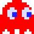

= Sample Images
// TOC Settings:
:toclevels: 5
// TOC ... HTML Backend Hack to show TOC on the Left
ifdef::backend-html5[]
:toc: left
endif::[]
// TOC ... GitHub Hack to show TOC after Preamble (required)
ifdef::env-github[]
:toc: macro
endif::[]
// Misc Settings:
:figure-caption: Example
:idprefix:
:!sectnums:
:experimental: true
:icons: font
:linkattrs: true
:reproducible: true
:sectanchors: true
// GitHub Settings for Admonitions Icons:
ifdef::env-github[]
:caution-caption: :fire:
:important-caption: :heavy_exclamation_mark:
:note-caption: :information_source:
:tip-caption: :bulb:
:warning-caption: :warning:
endif::[]

// *****************************************************************************
// *                                                                           *
// *                            Document Preamble                              *
// *                                                                           *
// *****************************************************************************

Example SVG images created with *pmotion2svg*.

// >>> GitLab/GitHub hacks to ensure TOC is shown after Preamble: >>>>>>>>>>>>>>
ifndef::backend-html5[]
'''
toc::[]
'''
endif::[]
ifdef::env-github[]
'''
toc::[]
'''
endif::[]
// <<< GitHub/GitLab hacks <<<<<<<<<<<<<<<<<<<<<<<<<<<<<<<<<<<<<<<<<<<<<<<<<<<<<

// »»» CUSTOM ATTRIBUTES »»»»»»»»»»»»»»»»»»»»»»»»»»»»»»»»»»»»»»»»»»»»»»»»»»»»»»»
:blinky_pmp: pass:q[link:blinky.pmp[`blinky.pmp`,title="Pro Motion NG source project"]]
:blinky_png: pass:q[link:blinky.png[`blinky.png`,title="PNG converted preview"]]
:blinky1: pass:q[link:blinky1.svg[`blinky1.svg`,title="SVG example 1"]]
:blinky2: pass:q[link:blinky2.svg[`blinky2.svg`,title="SVG example 2"]]
:blinky3: pass:q[link:blinky3.svg[`blinky3.svg`,title="SVG example 3"]]
:blinky4: pass:q[link:blinky4.svg[`blinky4.svg`,title="SVG example 4"]]

== Images List

* {blinky_pmp} -- Pro Motion Project file (14x14 px).
* {blinky_png} -- PNG image preview (14x14 px).
* {blinky1} -- SVG example 1.
* {blinky2} -- SVG example 2.
* {blinky3} -- SVG example 3.
* {blinky4} -- SVG example 4.

== Original Image

The original Pixel Art image is the {blinky_pmp} Pro Motion Project file, which is show below in PNG format:

It's a 14x14 pixels sprite of the Blinky ghost from Pac-Man.

== Genreated SVG Images

:svgSize: 450

And here are some examples of SVG images created by exporting the original image via *pmotion2svg*, using different settings in the plug-in's Options Dialog.

TIP: Click on a image to view it full size.

[%autowidth]
[cols="^.^a,<.<a"]
|===============================================================================
| .{blinky1}
[link=blinky1.svg]

| [discrete]
=== `blinky1.svg`

* Scale factor: 5
* Padding: none
* Grid: none
* Transparent color: preserve

| .{blinky2}
image::blinky2.svg[SVG 2,width={svgSize}]
| [discrete]
=== `blinky2.svg`

* Scale factor: 5
* Padding: none
* Grid: draw
* Transparent color: preserve

|
.{blinky3}

| [discrete]
=== `blinky3.svg`

* Scale factor: 10
* Padding: 10
* Grid: draw
* Transparent color: paint

|
.{blinky4}

| [discrete]
=== `blinky4.svg`

* Scale factor: 2
* Padding: none
* Grid: draw
* Transparent color: paint

|===============================================================================

// EOF //
